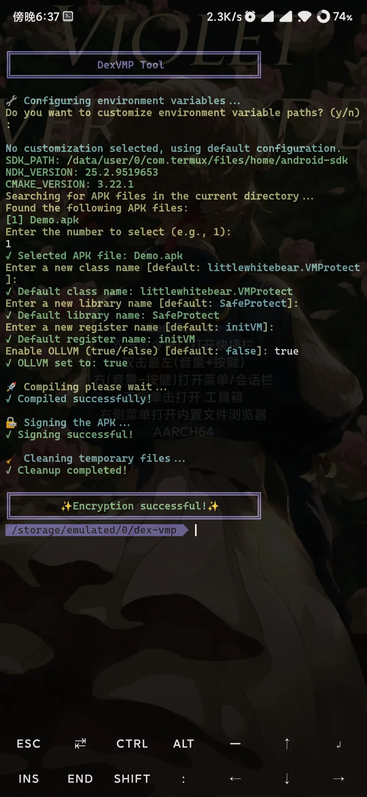

# DexVMP

[English](README_en.md)

基于dex-vm运行dalvik字节码从而对dex进行保护，增加反编译难度。

## 修改说明：

以下是一些简单的修改说明(没啥特别的主要方便)：

### 1. 合并vm库

### 2. 添加ollvm混淆

### 3. 随机字符串加密

### 4. 自定义vm类名

### 5. 自定义vm库名

### 6. 自定义vm注册名

### 7. 支持synthetic方法保护

### Termux一键安装NDK(支持ollvm)[r25c](https://github.com/Party233/DexVMP/releases/tag/android-ndk-r25c-ollvm):
```
cd && pkg upgrade && pkg install wget && wget https://github.com/Party233/DexVMP/raw/master/termux-ndk.sh --no-verbose --show-progress -N && chmod +x termux-ndk.sh && bash termux-ndk.sh
```

### 设置NDK和环境变量(可自行配置)

```bash
export SDK_PATH=/data/user/0/com.termux/files/home/android-sdk
export NDK_PATH=/data/user/0/com.termux/files/home/android-sdk/ndk/25.2.9519653
export CMAKE_PATH=/data/user/0/com.termux/files/home/android-sdk/cmake/3.22.1
```  

### 运行脚本(Termux)

```  bash
bash start-vm.sh
```  

### 手动执行

```  bash
java -jar vm-protect.jar apk input.apk convertRules.txt mapping.txt
```  

## 项目来源

本项目源自[nmmp](https://github.com/maoabc/nmmp)

---
